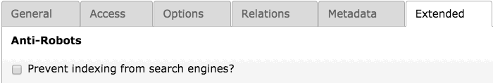

.. ==================================================
.. FOR YOUR INFORMATION
.. --------------------------------------------------
.. -*- coding: utf-8 -*- with BOM.

.. include:: ../Includes.txt

What does it do?
================

With this extension a addition checkbox is added to the news content object in the extended tab.
If checked the detail view will add a robots noindex to the header or add to
a existing robots tag.

This extension also works with metaseo active. The existing meta tag will be
complemented.

